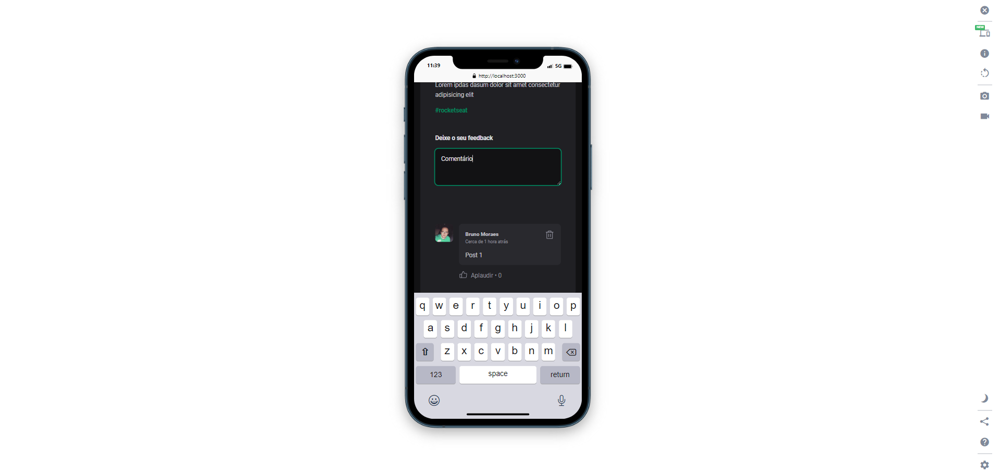

# rocketseat_2022_fundamentos_reactjs


# Descrição do projeto

Projeto desenvolvido pelo modulo Ignite da Rocketseat, onde construimos uma aplicação de feed de noticia. o link do projeto Figma:

 <a href="https://www.figma.com/file/8bnfyznaq77UgkZHtv8e80/Ignite-Feed-(Community)?node-id=26%3A12"> Link para projeto figma:
 </a>


# Assets

| 
| :---: | :---: |
| 


## Tecnologias

Este projeto foi feito utilizando as seguintes tecnologias:

- [VITE](https://vitejs.dev/)
- [React](https://reactjs.org/)
- [Typescript](https://www.typescriptlang.org/)
- [Phosphor Icons](https://phosphoricons.com/)

## Tutorial de instalação

Clone o projeto

```term

git clone git@github.com:moraes3000/rocketseat_2022_fundamentos_reactjs.git

```

Instale as dependências

```term

yarn

```

Rode o projeto

```term

yarn dev

```

Acesse [http://localhost:3000](http://localhost:3000/) para ver o resultado.